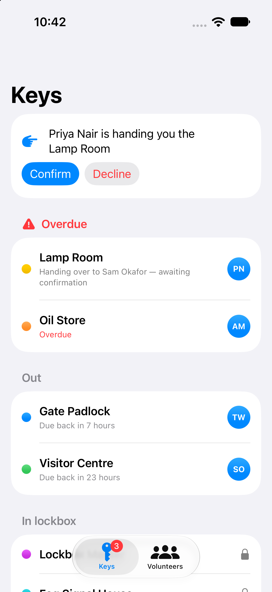
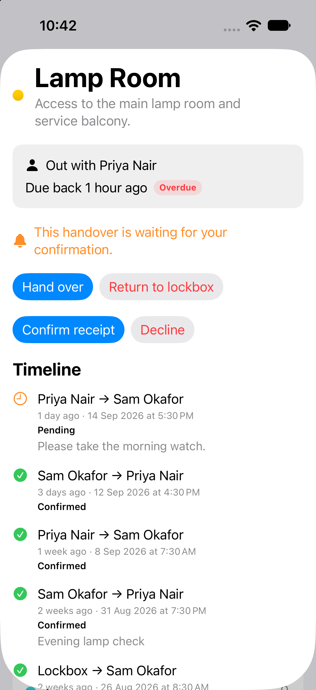
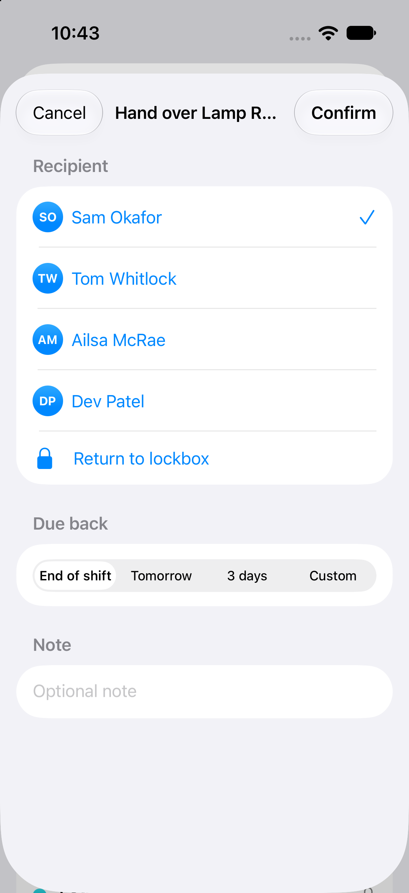
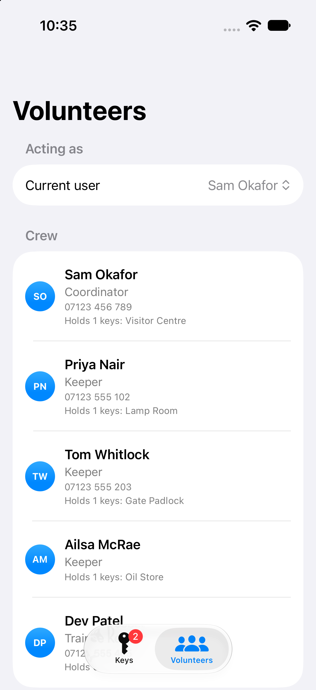
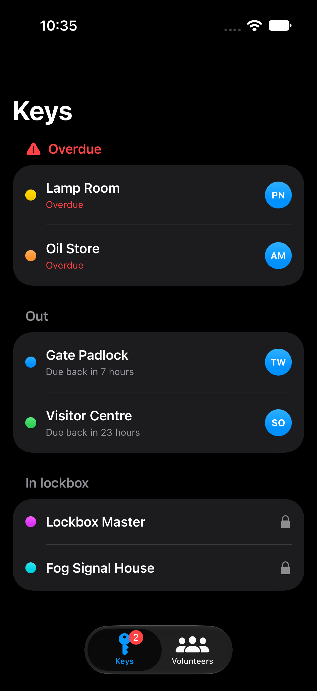

# Key Handover Log

Key Handover Log is a small iPhone and iPad app for lighthouse crews who need to
know who has each key, when it should come back, and what happened at the last
handover. It is designed for volunteer keepers and coordinators.

## Screenshots

## How to run

1. Open `KeyHandoverLog.xcodeproj` in Xcode.
2. Choose an iPhone or iPad simulator.
3. Press Run.

The first launch includes fresh sample data for Gannet Point Lighthouse.

## How to install on your own iPhone

Connect your iPhone to your Mac and choose it as the Xcode destination. In
**Signing & Capabilities**, choose your personal Team (a free Apple ID works).
Run the app, then trust the developer profile on your phone at **Settings >
General > VPN & Device Management**. Free-account installs expire after 7 days.
A $99/year Apple Developer account and TestFlight remove that limitation.

## Demo mode

This first version works offline. The log is saved as a JSON file in the app's
Documents folder, and the current user selection is saved on the device.

## What's next

Future versions could add Supabase sync, push notifications, and photos of keys
or handover notes.
